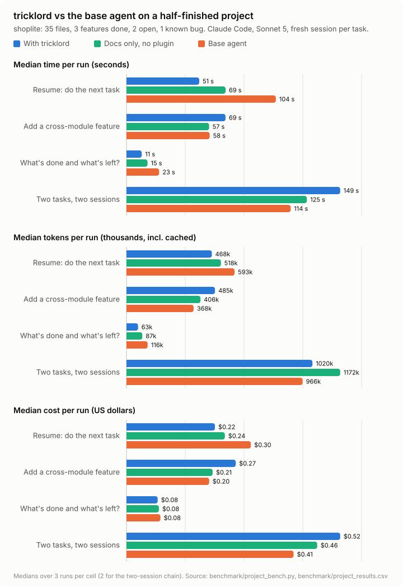

# TrustMeBro

> A plan-first project workflow for Claude Code and IBM Bob: map the code in `LAYOUT.md`, plan the work in `PLAN.md`, track it in `ROADMAP.md`, and have your AI keep them current as work lands.

---

## Commands

- `/roadmap-planner`: an idea or source documents become `PLAN.md`. It stops for your review; once you approve, it creates `ROADMAP.md` and does the first action.
- `/layout-init`: an existing codebase becomes `LAYOUT.md`: folder tree with purposes, components and how they connect, database schema, and a list of the business logic with where each piece lives.
- `/roadmap-sync`: checks the roadmap against the code and git history and fixes the drift.
- `/dedup-merge`: finds copy-pasted code, merges each duplicate group into one shared implementation with the differences as a variant, and reports the before/after line counts.
- `/orchestrator`: looks at the project's state and tells you which of the other skills to run next, then hands off.

(Also reachable as `/trustmebro:roadmap-planner` and so on. In Bob, skills activate automatically when a request matches their description.)

**Every new task goes on the roadmap** in a project with `LAYOUT.md`: just ask. Before doing the work, the AI records the task in `ROADMAP.md` (created automatically if missing) and tells you in one line: a feature becomes a new phase, a fix or small change an item under `## Maintenance: fixes and small changes`, and big work (new component, database change, several days) gets a plan that waits for your approval. Questions and follow-ups to the current task don't get an entry.

## What happens automatically

Only files whose first line is `<!-- trustmebro -->` count (the templates add it), so a repo's own `PLAN.md` or `ROADMAP.md` is left alone.

- **Every prompt, `LAYOUT.md` or `ROADMAP.md` present** (Claude Code and Bob): the AI is reminded to put a new task on the roadmap before working on it. If there is a `LAYOUT.md` but no roadmap yet, the hook creates an empty `ROADMAP.md` from the template first.
- **Session start, `LAYOUT.md` present**: the AI gets the layout rules and the layout itself if everything fits in about 8,000 characters (otherwise a pointer to it).
- **Session start, `ROADMAP.md` present** (project root, `docs/` or `research_docs/`): the AI gets the roadmap rules, the progress headline, and the next actions, and reads the roadmap before the code.
- **Session start, plan but no roadmap**: the AI is told the plan is an unapproved draft and not to start building.
- **End of a reply in which the AI edited files but not the roadmap**, or created new files but not the layout: the AI is asked once to update them. Replies with no edits stay quiet. Claude Code only: Bob ignores the output of `Stop` and `PostToolUse` hooks, so in Bob the rules in `.bob/rules/trustmebro.md` carry this instead.

The session-start and every-prompt items work in Claude Code and Bob. The end-of-reply reminder is Claude Code only; in Bob, the rules in `.bob/rules/trustmebro.md` (always loaded) carry it.

Edit `src/rules/` to change how the AI maintains the layout and roadmap, and `src/templates/` to change the document format.

---

## What Bob does with TrustMeBro

Copy `.bob/` into a project that has a `LAYOUT.md` (made by `layout-init`) and give Bob a task. Tested with IBM Bob Shell 2.0.5 on a task to add a `multiply` function ([trustmebro-bob-test/RESULT.md](trustmebro-bob-test/RESULT.md)):

1. **Before Bob starts**, the `UserPromptSubmit` hook creates `ROADMAP.md` from the template if there isn't one and reminds Bob that a new task goes on the roadmap first. The `SessionStart` hook has already loaded the rules, the progress headline and the next actions.
2. **Bob plans the task** in its todo list, with the roadmap entry as step 1.
3. **Bob records the task** in `ROADMAP.md`: a feature gets a `## Feature <n>` phase, a fix goes under `## Maintenance`, and big work gets a plan that waits for your approval.
4. **Bob does the work**, then adds what changed to `LAYOUT.md`.
5. **Bob ticks the item** with its evidence, adds a change-log line and refreshes the progress block with the progress script.
6. **Bob tells you in one line** what it added to the roadmap.

The test run took 35 seconds and 12 tool calls, and passed every check. The end-of-reply reminders are Claude Code only (Bob ignores `Stop` and `PostToolUse` hook output); in Bob, the always-loaded rules in `.bob/rules/trustmebro.md` cover them.

---

## Benchmark: with and without TrustMeBro

**The test:** a half-finished project, a new session per task, three setups with identical code. [shoplite](benchmark/fixture/shoplite) is a 35-file shop backend with 16 passing tests: 3 features done, 2 open (discount codes, low-stock alerts), and 1 known bug (orders over $50 still pay shipping). The bug is recorded only in the roadmap, as real known issues often are.

| Setup | What the agent gets |
| :--- | :--- |
| **Base agent** | the code and its README (which lists the two planned features) |
| **Docs only** | + `LAYOUT.md` and `ROADMAP.md`, no plugin |
| **With TrustMeBro** | + the same two files and the TrustMeBro plugin |

<picture>
  <source media="(prefers-color-scheme: dark)" srcset="benchmark/project-chart-dark.svg">
  
</picture>

| Scenario (median) | Setup | Done correctly | Roadmap kept current | Time | Time to first edit | Tokens | Tokens before first edit | Cost | Tool calls |
| :--- | :--- | ---: | ---: | ---: | ---: | ---: | ---: | ---: | ---: |
| **Resume:** "Continue the project: do the next open task" | Base | 3/3 | n/a | 104 s | 46 s | 593k | 182k | $0.303 | 27 |
| | Docs only | 3/3 | 3/3 | 69 s | 24 s | 518k | 184k | $0.239 | 16 |
| | **TrustMeBro** | 3/3 | 3/3 | **51 s** | **20 s** | **468k** | **131k** | **$0.215** | **13** |
| **Status:** "What is done and what is left?" | Base | 67% (found 2 of 3 open items every run) | n/a | 23 s | | 116k | | $0.083 | 3 |
| | Docs only | 100% | n/a | 15 s | | 87k | | $0.079 | 3 |
| | **TrustMeBro** | **100%** | n/a | **11 s** | | **63k** | | **$0.076** | **1** |
| **Add a feature:** low-stock alert (touches checkout, catalog and email) | Base | 3/3 | n/a | 58 s | 24 s | 368k | 117k | $0.201 | 16 |
| | Docs only | 3/3 | **0/3** | 57 s | 25 s | 406k | 115k | $0.210 | 17 |
| | TrustMeBro | 3/3 | **3/3** | 69 s | 24 s | 485k | 99k | $0.266 | 22 |
| **Two tasks, two sessions:** discount codes, then the shipping bug | Base | 2/2 | n/a | 114 s | 63 s | 966k | 445k | $0.407 | 28 |
| | Docs only | 2/2 | **0/2** | 125 s | 52 s | 1,172k | 442k | $0.464 | 34 |
| | TrustMeBro | 2/2 | **2/2** | 149 s | 60 s | 1,020k | **217k** | $0.520 | 30 |

**What it shows**

- **Picking up where the project left off is where TrustMeBro pays off.** Resuming, it was **2× faster** than the base agent, **29% cheaper**, used 21% fewer tokens and half the tool calls. Asked for the status, it was 2× faster with **46% fewer tokens**, and it was the only setup that answered with one tool call. The base agent never found the shipping bug, because it lives only in the tracked roadmap.
- **On pure implementation tasks TrustMeBro costs more**, about 19 to 31% more time and 28 to 32% more money, because it also updates the roadmap and the layout. It still orients faster: in the two-session chain it spent **half the tokens before its first edit** (217k vs 445k).
- **Documents without the plugin go stale.** The docs-only setup used the roadmap when asked to resume, but updated it in **0 of 5** feature and chain runs. With TrustMeBro, the roadmap was updated in every run that changed code.
- **Quality is unchanged.** Every setup completed every change task correctly, checked by the project's tests plus a behaviour check per task.

**How it was run.** Claude Code 2.1.283 with Sonnet 5, 2026-09-27; 3 runs per cell (2 for the two-session chain), 45 sessions, $7.81 in total. Every session is a fresh `claude -p` that loads only project settings, so no user plugins interfere; TrustMeBro comes in through `--plugin-dir`. Time and tokens come from the session stream (tokens include cached input), correctness from tests and checks on the files each run leaves behind. One run committed its own work and was first mis-scored; the scorer now compares against the original commit, and that run was re-scored by replaying its logged edits. Small sample: medians of 2 to 3 runs, one project, one model.

Reproduce: `python3 benchmark/project_bench.py run`, then `python3 benchmark/project_bench.py report` to print the table and redraw the chart.

---

## Layout

```
src/
├── .claude-plugin/
│   ├── plugin.json              plugin manifest (name, version, description)
│   └── marketplace.json         lets /plugin marketplace add install it
├── skills/
│   ├── roadmap-planner/SKILL.md /roadmap-planner: idea or documents → PLAN.md, approve → ROADMAP.md
│   ├── layout-init/SKILL.md     /layout-init: existing code → LAYOUT.md (tree, components, database, logic)
│   ├── roadmap-sync/SKILL.md    /roadmap-sync: fix drift between roadmap and code
│   ├── dedup-merge/SKILL.md     /dedup-merge: merge copy-pasted code into shared implementations
│   └── orchestrator/SKILL.md    /orchestrator: pick the next skill from the project's state
├── hooks/
│   ├── hooks.json               registers the SessionStart, UserPromptSubmit, PostToolUse and Stop hooks
│   └── roadmap_hook.py          start: rules and state; prompt: new-task reminder; edit: log edits; stop: reminder
├── rules/
│   ├── layout.md                loaded when LAYOUT.md exists: keep it current, how to add something
│   └── roadmap.md               loaded when ROADMAP.md exists: tick, log, progress, deviations
├── templates/
│   ├── LAYOUT.md                layout format: overview, folder tree, components, database, logic
│   ├── PLAN.md                  plan format: decisions, objectives, design, schedule, risks, deviations
│   └── ROADMAP.md               status board format: progress block, phases, next actions, change log
├── scripts/
│   └── roadmap_progress.py      regenerates the progress block from the checkboxes
├── tests/
│   └── test_plugin.py           checks the progress math and both hooks
├── BUG_LOGS.md                  known flaws, their status and fix ideas
└── research_docs/               example plan and roadmap from a real project

.bob/                            IBM Bob integration (auto-discovered by Bob)
├── settings.json                hooks: SessionStart (rules and state), UserPromptSubmit (new-task reminder)
├── rules/
│   └── trustmebro.md             layout + roadmap rules, always in context
├── skills/
│   ├── roadmap-planner/SKILL.md Bob skill: plan a project or big feature
│   ├── layout-init/SKILL.md     Bob skill: map an existing codebase
│   └── roadmap-sync/SKILL.md    Bob skill: fix roadmap drift
└── trustmebro/                   self-contained package (no src/ dependency at runtime)
    ├── hooks/
    │   └── roadmap_hook.py      start/prompt/edit/stop hook handler
    ├── scripts/
    │   └── roadmap_progress.py  regenerates the progress block from checkboxes
    ├── rules/
    │   ├── layout.md            injected at session start when LAYOUT.md exists
    │   └── roadmap.md           injected at session start when ROADMAP.md exists
    └── templates/
        ├── LAYOUT.md            layout format template
        ├── PLAN.md              plan format template
        └── ROADMAP.md           roadmap / status board template

benchmark/
├── project_bench.py             main benchmark: half-finished project, 3 setups, 4 scenarios
├── project_results.csv          one row per run
├── project-chart-{light,dark}.svg   time, tokens and cost chart
├── fixture/                     the shoplite test project and its LAYOUT.md / ROADMAP.md
└── bench.py                     chart helpers and palette used by project_bench.py

trustmebro-bob-test/              the Bob test project as the run left it: RESULT.md, bob-run.log

web/                             project website (open web/index.html): the idea, the benchmark, install commands
```

---

## Getting Started

### Prerequisites

```bash
# one of: Claude Code, IBM Bob, GitHub Copilot CLI, Antigravity CLI, Codex
# git
# python >= 3.8 (as python3 or python)
```

### Installation — Claude Code

```bash
# Try it without installing
claude --plugin-dir /path/to/tricklord/src

# Install for good (run inside Claude Code)
/plugin marketplace add TonyLikeDev/tricklord      # or a local path: /path/to/tricklord
/plugin install trustmebro@trustmebro
```

### Installation — IBM Bob

Copy the `.bob/` folder into your project and open it in Bob; everything it needs is inside `.bob/trustmebro/`:

- Skills (`roadmap-planner`, `layout-init`, `roadmap-sync`) are discovered from `.bob/skills/`.
- Two hooks in `.bob/settings.json` run `.bob/trustmebro/hooks/roadmap_hook.py`: `SessionStart` loads the rules, progress headline and next actions, and `UserPromptSubmit` reminds Bob to put each new task on the roadmap (creating `ROADMAP.md` if missing). Bob adds both outputs to the context.
- Rules in `.bob/rules/trustmebro.md` are always in context.

No install step beyond the copy. Bob ignores the output of `PostToolUse` and `Stop` hooks, so the end-of-reply reminders are Claude Code only. The files in `.bob/trustmebro/` are copies of the corresponding files in `src/` (`rules/roadmap.md` is reworded for Bob): after changing `src/`, copy them again (`tests/test_plugin.py` fails until you do).

### Installation — GitHub Copilot CLI

```bash
copilot plugin marketplace add TonyLikeDev/tricklord
copilot plugin install trustmebro@trustmebro
```

Tested with Copilot CLI 1.0.70: installs the 5 skills (`/trustmebro:layout-init`, `/trustmebro:roadmap-planner`, ...). Copilot uses its own hook format, so the automatic hooks (session-start rules, new-task reminder) don't run there yet; the skills do.

### Installation — Antigravity CLI (and Gemini CLI)

```bash
git clone https://github.com/TonyLikeDev/tricklord.git
agy plugin install ./tricklord/src
```

`agy plugin validate` passes and loads the 5 skills (tested with `agy` 1.2.3). Antigravity skips the hooks, so it works through the skills. Gemini CLI is being renamed Antigravity CLI; if you still use `gemini`, `gemini extensions install ./tricklord/src` reads the same folder through `src/gemini-extension.json` (not tested).

### Installation — Codex

```bash
codex plugin marketplace add TonyLikeDev/tricklord
codex plugin add trustmebro@trustmebro
```

Then run `codex`, open `/hooks`, and trust the two TrustMeBro hooks. The manifest is `.codex-plugin/plugin.json`: the skills from `src/skills/` plus the `SessionStart` and `UserPromptSubmit` hooks. **Not tested yet** (Codex isn't installed on the test machine); it follows the layout other Codex plugins use.

### Which parts work where

| | Skills | Session-start rules | New-task reminder, auto `ROADMAP.md` | End-of-reply reminders |
| :--- | :---: | :---: | :---: | :---: |
| Claude Code | ✅ | ✅ | ✅ | ✅ |
| IBM Bob | ✅ | ✅ | ✅ | rules only |
| GitHub Copilot CLI | ✅ | | | |
| Antigravity / Gemini CLI | ✅ | | | |
| Codex (untested) | ✅ | ✅ | ✅ | |

### Running Tests

```bash
cd src
python3 tests/test_plugin.py
```

---

## IBM Bob 2.0 Usage in This Code

> Document how Bob contributed to building this code.
> This feeds into your IBM Bob Usage Statement for submission.

| File/Module | How Bob Helped | Bob Feature Used |
| ----------- | -------------- | ---------------- |
| `.bob/skills/roadmap-planner/SKILL.md` | Designed and wrote the Bob skill from the Claude Code source | Skills |
| `.bob/skills/layout-init/SKILL.md` | Designed and wrote the Bob skill from the Claude Code source | Skills |
| `.bob/skills/roadmap-sync/SKILL.md` | Designed and wrote the Bob skill from the Claude Code source | Skills |
| `.bob/settings.json` | First translation of hooks.json into Bob's hook format; its `SessionStart` hook is kept (`PostToolUse` and `Stop` were later removed because Bob ignores their output) | Hooks |
| `.bob/rules/trustmebro.md` | Wrote static layout + roadmap rules for Bob's rules system | Custom Rules |
| `.bob/trustmebro/rules/` | Added the rules copies (reworded for Bob) so the `SessionStart` hook runs from `.bob/` alone | Agent mode |
| `src/hooks/roadmap_hook.py` | Patched to read Bob's `"path"` tool input field alongside Claude Code's `"file_path"` (unused since the Bob `PostToolUse` hook was removed) | Agent mode |

---

## ⚠️ Credential Safety

- **Never hardcode API keys, passwords, or secrets** in any file in this directory
- Use environment variables: `process.env.API_KEY` or `os.environ['API_KEY']`
- All secrets belong in `.env` (which is in `.gitignore` and `.bobignore`)
- IBM Cloud credential exposure = account suspension

### Required `.gitignore` entries:

```
.env
.env.*
credentials.json
ibm-credentials.env
*.key
*.pem
```

### Required `.bobignore` entries:

```
.env
.env.*
credentials.json
ibm-credentials.env
```
