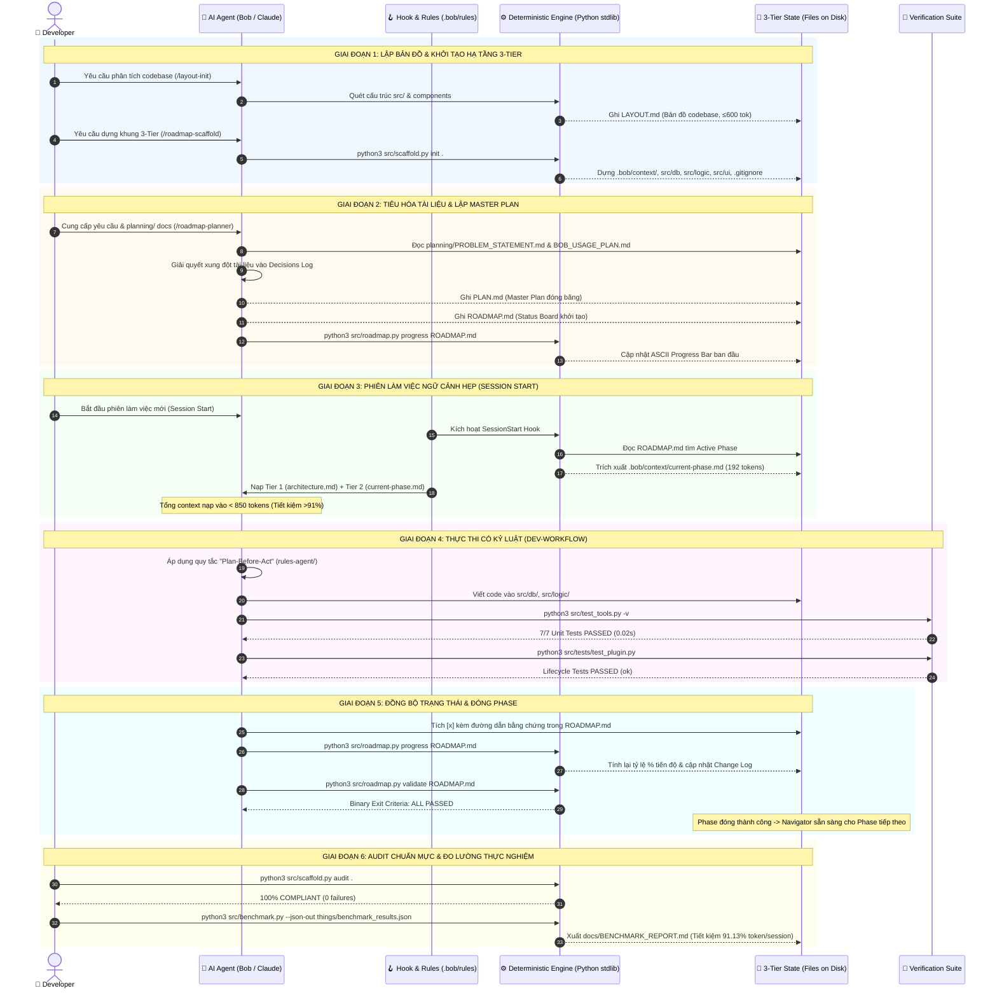
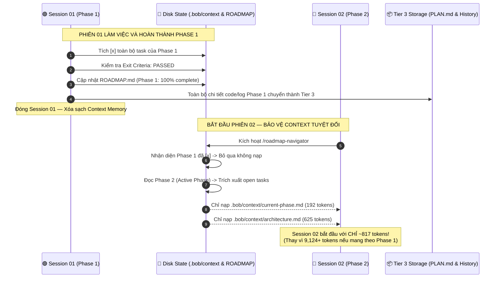
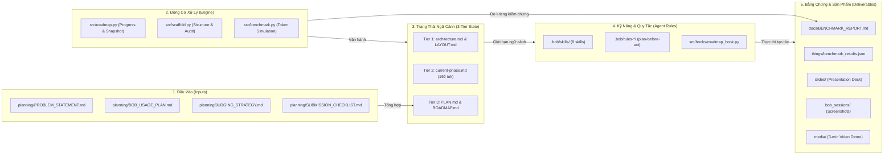
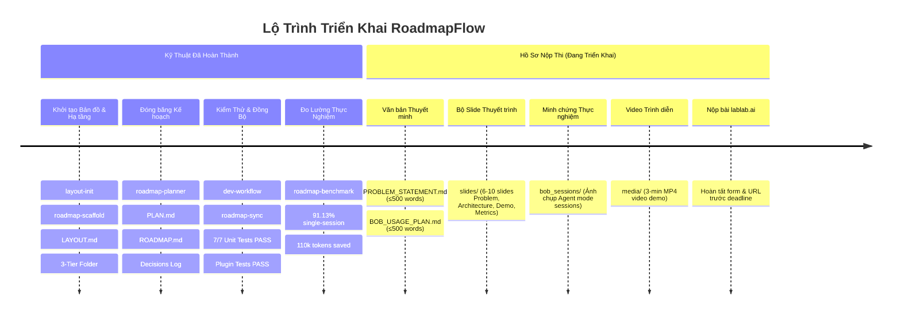

# 🧭 00. Cấu Trúc Lộ Trình Thông Tin & Bản Đồ Hệ Thống Toàn Diện

> [!important] Tuyên Ngôn Kiến Trúc Thông Tin (Information Architecture)
> Một hệ thống AI-assisted đa phiên không thể hoạt động tin cậy nếu thiếu **Lộ trình thông tin (Information Roadmap)**. Lộ trình này xác lập ranh giới quyền hạn dữ liệu (data boundaries), cơ chế chuyển giao giữa các phiên làm việc (multi-session handoff) và cách thức chuyển đổi từ yêu cầu sơ khởi thành các bằng chứng nghiệm thu (artifacts) có thể đo lường định lượng.

---

## 🔁 1. Sequence Diagram: Luồng Vận Hành Toàn Diện (End-to-End Execution)

Biểu đồ trình tự mô tả tương tác khép kín giữa **Developer**, **AI Agent (Bob/Claude)**, **Hook & Rules Engine**, **Deterministic Core CLI**, **Hệ thống tệp (3-Tier State)** và **Bộ công cụ kiểm định (Verification Suite)**.

---

## 🔀 2. Sequence Diagram: Chuyển Giao Phiên Không Tràn Token (Multi-Session Handoff)

Biểu đồ này chứng minh cơ chế **cắt đứt sự tích tụ token** giữa các phiên làm việc — giải quyết triệt để vấn đề "Quality Cliff" (>100k tokens) của AI.

---

## 🗺️ 3. Bản Đồ Ánh Xạ Thông Tin Toàn Bộ Hệ Thống (Master Information Mapping)

Dưới đây là bảng ánh xạ toàn diện (Traceability Matrix) cho từng tập tin và thư mục trong `/home/pro/hackathon`:

---

### Bảng Ánh Xạ Chi Tiết Từng Tập Tin (File-by-File Traceability Matrix)

| Đường Dẫn Tệp Tin | Phân Tầng Thông Tin | Vai Trò & Trách Nhiệm | Nguồn Chân Lý (Authority) | Ngân Sách / Kích Thước | Tần Suất Truy Cập LLM |
| :--- | :--- | :--- | :--- | :---: | :--- |
| **`planning/*.md`** | Tầng 1: Chiến lược | Yêu cầu hackathon, tiêu chí chấm thi, ý tưởng thô | Tác giả dự án | ~8,500 tok | Đọc 1 lần khi `/roadmap-planner` |
| **`src/roadmap.py`** | Tầng 2: Engine CLI | Lôgic toán tiến độ, trích xuất snapshot, validate | Codebase Engine | 310 dòng stdlib | Thực thi qua terminal (0 tok LLM) |
| **`src/scaffold.py`** | Tầng 2: Engine CLI | Dựng cây thư mục 3-Tier, audit chuẩn token | Codebase Engine | 365 dòng stdlib | Thực thi qua terminal (0 tok LLM) |
| **`src/benchmark.py`** | Tầng 2: Engine CLI | Giả lập 10 sessions, đo lường token thực tế | Codebase Engine | ~250 dòng stdlib | Chạy khi kết xuất báo cáo |
| **`LAYOUT.md`** | Tầng 3: Tier 1 Context | Bản đồ cấu trúc code, components, database, logic | Trạng thái mã nguồn | 75 dòng (~500 tok) | Luôn nạp đầu phiên làm việc |
| **`.bob/context/architecture.md`** | Tầng 3: Tier 1 Context | Quyết định kiến trúc bất biến, stack, quy tắc | Trạng thái kiến trúc | **625 tokens** | Luôn nạp đầu phiên làm việc |
| **`.bob/context/current-phase.md`** | Tầng 3: Tier 2 Context | Danh sách open tasks của giai đoạn hiện tại | Engine tự động sinh | **192 tokens** | Luôn nạp đầu phiên làm việc |
| **`PLAN.md`** | Tầng 3: Tier 3 Storage | Master Plan đóng băng, Decisions Log, rủi ro | Kế hoạch dự án | 120 dòng (Tier 3) | Chỉ truy vấn qua Subagent khi cần |
| **`ROADMAP.md`** | Tầng 3: Tier 3 Storage | Bảng tiến độ sống, checkbox `[x]`, Change Log | Tiến độ thực tế | 108 dòng (Tier 3) | Đọc/Ghi bởi CLI và Agent |
| **`.bob/rules-*/`** | Tầng 4: Kỷ luật Agent | Ràng buộc Agent: Plan-Before-Act, không gọi thừa | Kỷ luật hệ thống | ~150 tok/mode | Nạp theo mode (`ask`, `plan`, `agent`) |
| **`.bob/skills/`** | Tầng 4: Kỹ năng Agent | 9 kỹ năng chuyên biệt điều phối vòng đời | Tập lệnh AI | Theo từng lệnh | Chỉ nạp khi skill được gọi |
| **`docs/BENCHMARK_REPORT.md`** | Tầng 5: Bằng chứng | Báo cáo đo lường tiết kiệm 91.13% token | Benchmark Engine | Báo cáo hoàn chỉnh | Hồ sơ nộp giám khảo |
| **`things/benchmark_results.json`** | Tầng 5: Dữ liệu thô | Kết quả đo đạc token thô của 10 sessions | Benchmark Engine | Dữ liệu số đo JSON | Phục vụ kiểm toán độc lập |
| **`slides/`** | Tầng 5: Trình chiếu | Bộ Slide 6–10 trang nộp thi hackathon | Đội ngũ dự thi | File PDF/PPTX | Hồ sơ nộp lablab.ai |
| **`bob_sessions/`** | Tầng 5: Minh chứng | Ảnh chụp màn hình phiên làm việc Bob IDE thực | Phiên thực tế | File ảnh `.png` | Minh chứng bắt buộc của ban tổ chức |
| **`media/`** | Tầng 5: Video Demo | Kịch bản & Video quay demo màn hình 3 phút | Đội ngũ dự thi | File `.mp4` | Trọng số chấm thi cao nhất |

---

## 🎯 4. Lộ Trình Triển Khai Thực Tế (Execution Milestones)

---

## 🔗 Liên Kết Tới Các Ghi Chú Liên Quan
- Trở về mục lục chính: [[README|🧭 MOC]]
- Kiến trúc chi tiết: [[01-RoadmapFlow-Architecture|🏗️ 01. Kiến Trúc & Mô Hình 3-Tier]]
- Chi tiết thực thi 9 skills: [[02-Skills-Lifecycle-Review|⚡ 02. Đánh Giá Vòng Đời 9 Skills]]
- Số liệu thực nghiệm chi tiết: [[03-Empirical-Token-Benchmark|📊 03. Đo Lường Token Thực Nghiệm]]
- Ma trận kiểm thử & bằng chứng: [[04-Verification-Matrix|🛡️ 04. Ma Trận Xác Minh & Tuân Thủ]]
