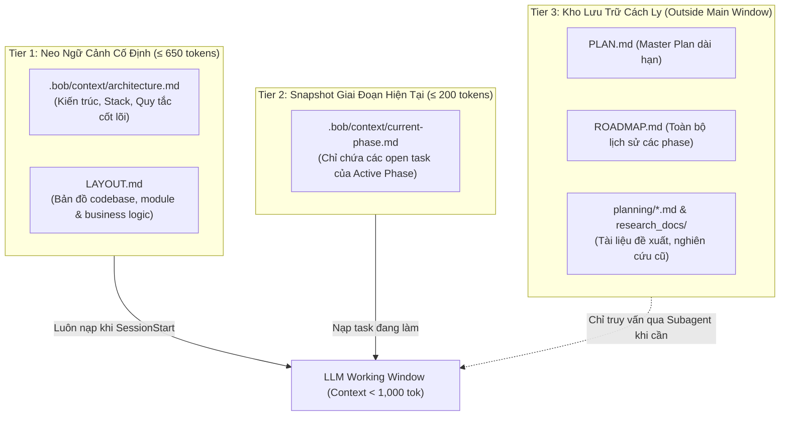

# 🏗️ 01. Kiến Trúc RoadmapFlow & Mô Hình Ngữ Cảnh 3-Tier

> [!info] Mục Đích Tài Liệu
> Tài liệu này mô tả chi tiết nền tảng kiến trúc của **RoadmapFlow**, quy trình phân tầng ngữ cảnh (3-Tier Context Model) và chiến lược xử lý tài liệu cũ/khởi tạo/nghiên cứu nhằm triệt tiêu lãng phí token và ngăn chặn sự suy giảm chất lượng suy luận của LLM.

---

## 1. Mô Hình Ngữ Cảnh 3 Phân Tầng (3-Tier Context Model)

Trong các dự án AI coding kéo dài qua nhiều phiên (multi-session), việc nạp toàn bộ lịch sử trao đổi, toàn bộ kế hoạch dự án và mã nguồn các phase đã hoàn thành vào context window sẽ gây ra hiện tượng **"Context Window Bloat"** và đưa mô hình qua **ngưỡng suy giảm chất lượng (>100k tokens)**.

RoadmapFlow giải quyết triệt để vấn đề này bằng việc phân tách nghiêm ngặt:



### Chi Tiết Từng Phân Tầng:

1. **Tier 1 — Architecture & Layout Anchor (Luôn luôn nạp)**:
   - **File**: `.bob/context/architecture.md` ($\le 650$ tokens) và `LAYOUT.md`.
   - **Nhiệm vụ**: Cung cấp cho AI biết dự án là gì, tech stack nào, các quyết định kiến trúc bất biến và bản đồ vị trí các file mà không cần quét lại ổ cứng.
2. **Tier 2 — Active Phase Snapshot (Phiên bản cục bộ, tự động làm mới)**:
   - **File**: `.bob/context/current-phase.md` ($\le 200$ tokens).
   - **Nhiệm vụ**: Chỉ trích xuất duy nhất các task chưa hoàn thành (`[ ]`) của Phase hiện tại. Khi hoàn thành phase, snapshot tự động chuyển sang phase kế tiếp.
   - **Quy tắc bảo mật**: Được loại trừ khỏi Git qua `.gitignore` để không gây xung đột giữa các developer.
3. **Tier 3 — Static Archive & Extended History (Cách ly bên ngoài)**:
   - **File**: `PLAN.md`, `ROADMAP.md`, thư mục `planning/`, tài liệu nghiên cứu `research_docs/`.
   - **Nhiệm vụ**: Lưu trữ toàn bộ bức tranh dự án. AI không bao giờ đọc trực tiếp các file này trong luồng làm việc chính mà chỉ truy cập qua Subagent chuyên biệt khi cần tra cứu.

---

## 2. Chiến Lược Xử Lý Tài Liệu Cũ & Tài Liệu Nghiên Cứu (`Document Ingestion`)

> [!question] Vấn Đề Đặt Ra
> Khi dự án có sẵn các tài liệu cũ (đề xuất sơ khởi, bản thiết kế cũ, tài liệu nghiên cứu `research_docs/` hoặc yêu cầu ban đầu trong `planning/`), hệ thống làm thế nào để tiếp thu mà không làm "bẩn" context window?

RoadmapFlow áp dụng quy trình 4 bước khép kín:

```text
[Tài liệu cũ / Specs / Init Docs]
               │
               ▼  1. INGEST (roadmap-planner đọc toàn bộ 1 lần)
[Xung đột giữa các tài liệu]
               │
               ▼  2. RESOLVE & SYNTHESIZE (Đưa vào Decisions Log)
[PLAN.md & LAYOUT.md] (Tĩnh hóa kiến trúc)
               │
               ▼  3. ISOLATE (Đưa tài liệu gốc vào Tier 3)
[LLM Session Context] (Chỉ giữ Tier 1 & Tier 2)
               │
               ▼  4. SYNC & DRIFT (roadmap-sync bắt diff mã nguồn & ghi Deviations)
```

1. **Ingest (Thu Thập Một Lần)**:
   Kỹ năng `roadmap-planner` đọc toàn bộ các tài liệu đầu vào tại `planning/` và `research_docs/`.
2. **Resolve (Hóa Giải Xung Đột)**:
   Nếu tài liệu A mâu thuẫn tài liệu B, hệ thống không tự ý xóa mà ghi nhận thành một dòng trong bảng `## 0. Decisions Log` của `PLAN.md`:
   `| Chủ đề | Tài liệu cũ nói gì | Quyết định chọn | Lý do lựa chọn |`
3. **Isolate (Cách Ly Ngữ Cảnh)**:
   Sau khi đã tổng hợp vào `PLAN.md` và `LAYOUT.md`, các tài liệu cũ được ghi danh vào mục **"What NOT to re-read every session"** trong file `architecture.md`. AI được chỉ dẫn không đọc lại chúng trong các phiên code hàng ngày.
4. **Traceable Deviations (Nhật Ký Sai Lệch)**:
   Nếu tài liệu cũ được người dùng cập nhật sau này, AI không sửa đè lịch sử mà ghi nhận một dòng nhật ký có ngày tháng vào mục `## Deviations` của `PLAN.md`.

---

## 3. Bản Đồ Thành Phần Hệ Thống & Luồng Dữ Liệu

| Thành Phần (Component) | Module Code | Trách Nhiệm Kỹ Thuật | Phụ Thuộc |
| :--- | :--- | :--- | :--- |
| **Deterministic Engine** | `src/roadmap.py` | Tính toán % tiến độ, vẽ thanh bar ASCII, trích xuất snapshot Tier 2, kiểm tra exit criteria | Python stdlib (`re`, `pathlib`, `argparse`) |
| **Scaffolder & Auditor** | `src/scaffold.py` | Sinh cấu trúc 3-Tier, layout component reuse, audit độ tuân thủ token | `src/roadmap.py` |
| **Benchmark Runner** | `src/benchmark.py` | Chạy giả lập 10 developer sessions, đo lường token chính xác | `src/roadmap.py` |
| **Session Lifecycle Hooks** | `src/hooks/roadmap_hook.py` | Nạp context khi SessionStart, nhắc nhở đồng bộ khi Stop | Plugin Event Bus |

---

## 🔗 Liên Kết Liên Quan
- Tiếp theo: [[02-Skills-Lifecycle-Review|Báo Cáo Chi Tiết Vòng Đời 9 Skills]]
- Đo lường token: [[03-Empirical-Token-Benchmark|Báo Cáo Đo Lường Thực Nghiệm]]
- Bản đồ tổng quan: [[README|MOC]]
