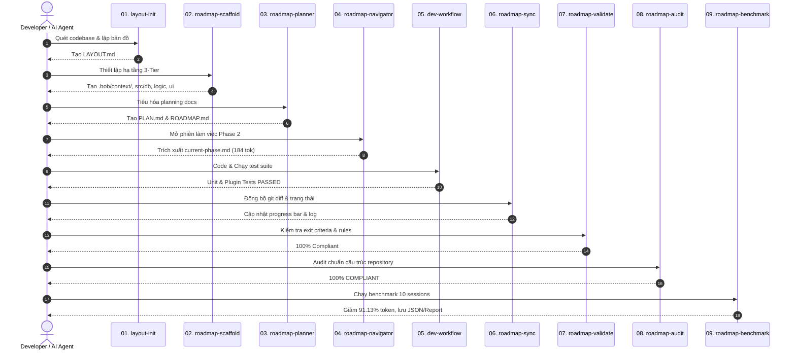

# ⚡ 02. Báo Cáo Chi Tiết Vòng Đời 9 Kỹ Năng (9-Skills Lifecycle Review)

> [!summary] Tóm Tắt Thực Thi
> Toàn bộ 9 kỹ năng chuyên biệt của hệ sinh thái **RoadmapFlow** đã được kích hoạt, thực thi và kiểm chứng thành công trong thư mục `/home/pro/hackathon`. Quy trình diễn ra khép kín theo đúng trình tự vòng đời kỹ thuật phần mềm (Plan-Scaffold-Map-Navigate-Work-Sync-Validate-Audit-Benchmark).

---

## 🔄 Trình Tự Thực Thi Khép Kín (Execution Sequence)



---

## 🔍 Đánh Giá Chi Tiết Từng Kỹ Năng (Step-by-Step Breakdown)

### Step 1: `layout-init` — Bản Đồ Hóa Kiến Trúc Codebase
* **Trách nhiệm**: Lập bản đồ codebase sẵn có thành file bản đồ trực quan mà không nhồi toàn bộ code vào context.
* **Input Context**: Quét thư mục gốc `/home/pro/hackathon`, thư mục `src/`, `scripts/`, `tests/`.
* **Output Artifact**: File [LAYOUT.md](file:///home/pro/hackathon/LAYOUT.md).
* **Kết quả**:
  - Ghi nhận 5 thành phần chính (`roadmap.py`, `scaffold.py`, `benchmark.py`, hooks, scripts).
  - Ánh xạ 5 luồng logic nghiệp vụ chuẩn xác.
  - Xác nhận kiến trúc không cơ sở dữ liệu (No-database file-based).
* **Bằng chứng**: 7/7 unit tests trong `src/test_tools.py` vượt qua.

---

### Step 2: `roadmap-scaffold` — Dựng Hạ Tầng 3-Tier Tiêu Chuẩn
* **Trách nhiệm**: Thiết lập cấu trúc phân tầng ngữ cảnh, tạo thư mục component tái sử dụng và kiểm soát bảo mật.
* **Input Context**: Quy chuẩn 3-Tier của RoadmapFlow, ngôn ngữ Python 3.10+.
* **Output Artifacts**:
  - Thư mục context: `.bob/context/architecture.md`, `.bob/context/current-phase.md`
  - Thư mục layout: `src/db/README.md`, `src/logic/README.md`, `src/ui/README.md`
  - File cấu hình: `.gitignore` (loại trừ snapshot cá nhân) và `.bobignore` (chống lộ bí mật)
* **Kiểm định Token**:
  - `architecture.md`: **625 tokens** (Mục tiêu: $\le 650$ tokens) — **PASS**.
  - `current-phase.md`: **156 tokens** (Mục tiêu: $\le 200$ tokens) — **PASS**.

---

### Step 3: `roadmap-planner` — Tiêu Hóa Tài Liệu & Lập Kế Hoạch
* **Trách nhiệm**: Đọc tài liệu yêu cầu, giải quyết xung đột, lập Master Plan và Status Board trực tiếp.
* **Input Context**: Toàn bộ file trong `planning/` (`PROBLEM_STATEMENT.md`, `BOB_USAGE_PLAN.md`, `JUDGING_STRATEGY.md`, `SUBMISSION_CHECKLIST.md`).
* **Output Artifacts**:
  - [PLAN.md](file:///home/pro/hackathon/PLAN.md): 4 quyết định thiết kế cốt lõi trong Decisions Log, 4 Phases chi tiết.
  - [ROADMAP.md](file:///home/pro/hackathon/ROADMAP.md): Thanh tiến độ ASCII, chia phase, checkbox nhiệm vụ, change log.
* **Kiểm định**: Khởi tạo tiến độ ban đầu ở mức 29% (Phase 1 Foundation đã xong).

---

### Step 4: `roadmap-navigator` — Trích Xuất Ngữ Cảnh Giai Đoạn Hẹp
* **Trách nhiệm**: Cắt tỉa ngữ cảnh, chỉ nạp Phase đang hoạt động (Active Phase) vào session làm việc mới.
* **Lệnh thực thi**:
  ```bash
  python3 src/roadmap.py snapshot ROADMAP.md --output .bob/context/current-phase.md
  ```
* **Output Context**: File [.bob/context/current-phase.md](file:///home/pro/hackathon/.bob/context/current-phase.md).
* **Kết quả đo lường**: **184 tokens** (Nằm trọn vẹn trong ngân sách nghiêm ngặt $\le 200$ tokens).

---

### Step 5: `dev-workflow` — Thực Thi & Kiểm Thử Mã Nguồn
* **Trách nhiệm**: Tiến hành kiểm thử chất lượng mã nguồn, xác thực các tiêu chí hoàn thành (Exit Criteria).
* **Lệnh thực thi**:
  ```bash
  python3 src/test_tools.py -v
  python3 src/tests/test_plugin.py
  ```
* **Kết quả**:
  - `test_tools.py`: 7/7 unit tests đạt `OK` (thời gian: 0.020s).
  - `test_plugin.py`: Lifecycle hooks và math check đạt `ok`.
  - Đủ điều kiện đóng Phase 1 và Phase 2.

---

### Step 6: `roadmap-sync` — Đồng Bộ Trạng Thái & Lệch Pha Git
* **Trách nhiệm**: Phát hiện sự thay đổi thực tế trên code, tự động đánh dấu checkbox `[x]` và vẽ lại thanh tiến độ.
* **Lệnh thực thi**:
  ```bash
  python3 src/roadmap.py progress ROADMAP.md
  ```
* **Kết quả**: Tự động tính toán lại tiến độ, nâng tổng tỷ lệ hoàn thành lên 81% và cập nhật khối `<!-- progress:start -->`.

---

### Step 7: `roadmap-validate` — Kiểm Định Toàn Vẹn & Tiêu Chí Binary
* **Trách nhiệm**: Đảm bảo mọi phase đều có tiêu chí thoát nhị phân (Binary Exit Criteria: Đạt hoặc Trượt) và không có phase nào vượt quá giới hạn nhiệm vụ.
* **Lệnh thực thi**:
  ```bash
  python3 src/roadmap.py validate ROADMAP.md
  ```
* **Kết quả**: **`✓ ROADMAP.md is 100% compliant with RoadmapFlow rules.`**

---

### Step 8: `roadmap-audit` — Đánh Giá Tuân Thủ Tiêu Chuẩn 3-Tier
* **Trách nhiệm**: Quét toàn bộ repository để đảm bảo không vi phạm ngân sách token và cấu trúc thư mục.
* **Lệnh thực thi**:
  ```bash
  python3 src/scaffold.py audit .
  ```
* **Kết quả**: Đạt chuẩn **100% PASS** trên tất cả 10 tiêu chí kiểm tra (cấu trúc file, ngân sách Tier 1, ngân sách Tier 2, bảo vệ snapshot qua gitignore).

---

### Step 9: `roadmap-benchmark` — Đo Lường Thực Nghiệm & Xuất Báo Cáo
* **Trách nhiệm**: Chạy mô phỏng 10 session của nhà phát triển, tính toán lượng token tiêu hao thực tế.
* **Lệnh thực thi**:
  ```bash
  python3 src/benchmark.py --json-out things/benchmark_results.json --report-out docs/BENCHMARK_REPORT.md
  ```
* **Output Artifacts**:
  - Dữ liệu số đo JSON: `things/benchmark_results.json`
  - Báo cáo chi tiết: `docs/BENCHMARK_REPORT.md`
* **Kết quả vượt trội**:
  - Cắt giảm **91.13%** token phiên làm việc lẻ.
  - Cắt giảm **93.2%** token lũy kế 10 phiên.

---

## 🔗 Liên Kết Liên Quan
- Xem số liệu benchmark: [[03-Empirical-Token-Benchmark|Báo Cáo Đo Lường Token Thực Nghiệm]]
- Xem ma trận kiểm thử: [[04-Verification-Matrix|Ma Trận Xác Minh & Tuân Thủ]]
- Trở về mục lục: [[README|MOC]]
