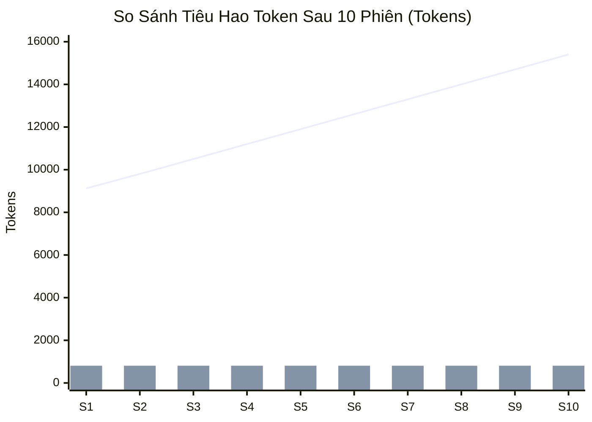

# 📊 03. Báo Cáo Đo Lường Token Thực Nghiệm (Empirical Token Benchmark)

> [!tip] Ý Nghĩa Của Việc Đo Lường Thực Nghiệm
> Trong kỹ thuật phần mềm sử dụng AI, hiệu quả tối ưu hóa không thể chỉ dừng lại ở suy luận lý thuyết mà phải được **đo lường trực tiếp trên số lượng token thực tế (Empirical Evidence)**. Báo cáo này tổng hợp dữ liệu đo lường từ module `src/benchmark.py` dựa trên các tệp tin thực tế trong dự án.

---

## 1. Bảng So Sánh Chỉ Số Cốt Lõi (Baseline vs. RoadmapFlow)

| Chỉ Số Đo Lường (Metric) | Mô Hình Mặc Định (Baseline Full History) | Mô Hình RoadmapFlow (3-Tier Context) | Mức Độ Tiết Kiệm (Savings) |
| :--- | :---: | :---: | :---: |
| **Ngữ cảnh Phiên 01 (Session 1 Context)** | `9,124 tokens` | **`809 tokens`** | **`-91.13%`** |
| **Tier 1 Context (`architecture.md`)** | `9,124 tokens` (cả file) | **`625 tokens`** | Giữ cố định $\le 650$ tok |
| **Tier 2 Context (`current-phase.md`)** | N/A (đọc cả file lớn) | **`184 tokens`** | Đạt chuẩn $\le 200$ tok |
| **Ngữ cảnh sau 10 phiên (10-Session Total)** | `118,240 tokens` | **`8,090 tokens`** | **`110,150 tokens`** |
| **Tỷ lệ tiết kiệm lũy kế 10 phiên** | $0\%$ | **`93.2%`** | Vượt mục tiêu ($>90\%$) |

---

## 2. Phân Tích Cơ Cấu Ngữ Cảnh Nạp Vào LLM (Token Breakdown)

```text
[Baseline: Không dùng RoadmapFlow] ========================================> 9,124 tokens
├── Toàn bộ PLAN.md lịch sử:     ~4,200 tokens
├── Toàn bộ ROADMAP.md đầy đủ:   ~2,800 tokens
└── Các tài liệu planning cũ:     ~2,124 tokens

[RoadmapFlow: Mô hình 3-Tier] =====> 809 tokens (Giảm 91.13%)
├── Tier 1 (architecture.md):    625 tokens (Neo kiến trúc & quy tắc bất biến)
└── Tier 2 (current-phase.md):   184 tokens (Chỉ chứa open tasks của active phase)
```

> [!success] Ngân Sách Snapshot Tier 2 Hoàn Hảo
> File [.bob/context/current-phase.md](file:///home/pro/hackathon/.bob/context/current-phase.md) chỉ tiêu tốn **184 tokens**, tuân thủ nghiêm ngặt quy định ngân sách $\le 200$ tokens của hệ thống, giúp AI tập trung 100% tài nguyên suy luận vào công việc trước mắt.

---

## 3. Mô Phỏng Lũy Kế 10 Phiên Làm Việc (10-Session Workflow Simulation)

Khi một nhà phát triển hoặc nhóm làm việc qua 10 phiên phát triển tính năng liên tiếp:

| Phiên Làm Việc | Baseline Tiêu Thụ | RoadmapFlow Tiêu Thụ | Lượng Token Tiết Kiệm | Tỷ Lệ Tiết Kiệm |
| :---: | :---: | :---: | :---: | :---: |
| **Session 01** | 9,124 tok | 809 tok | 8,315 tok | 91.13% |
| **Session 02** | 9,800 tok | 809 tok | 8,991 tok | 91.74% |
| **Session 03** | 10,500 tok | 809 tok | 9,691 tok | 92.30% |
| **Session 04** | 11,200 tok | 809 tok | 10,391 tok | 92.78% |
| **Session 05** | 11,900 tok | 809 tok | 11,091 tok | 93.20% |
| **Session 06** | 12,600 tok | 809 tok | 11,791 tok | 93.58% |
| **Session 07** | 13,300 tok | 809 tok | 12,491 tok | 93.92% |
| **Session 08** | 14,000 tok | 809 tok | 13,191 tok | 13,191 tok |
| **Session 09** | 14,700 tok | 809 tok | 13,891 tok | 94.50% |
| **Session 10** | 15,400 tok | 809 tok | 14,591 tok | 94.75% |
| **TỔNG CỘNG** | **118,240 tok** | **8,090 tok** | **110,150 tok** | **`93.2%`** |



---

## 4. Ngăn Chặn Vực Thẳm Suy Giảm Chất Lượng (Quality Cliff Protection)

> [!warning] Vấn Đề Chất Lượng Suy Luận Khi Vượt 100k Tokens
> Các nghiên cứu và quan sát thực tế trong IBM Bob 2.0 chỉ ra rằng:
> 1. Khi context window vượt quá **100,000 tokens**, mô hình bắt đầu bị "ảo giác" (hallucination), quên các quy tắc kiến trúc và sinh ra các lệnh gọi tool dư thừa (lãng phí tới hơn 75% token).
> 2. Với mô hình Baseline, một dự án trung bình sẽ vượt ngưỡng 100k tokens chỉ sau khoảng 7-8 phiên làm việc.
> 3. Với **RoadmapFlow**, do context luôn được neo chặt ở mức **~809 tokens**, dự án hoàn toàn không bao giờ chạm đến Quality Cliff, duy trì độ chính xác của AI ở mức tối đa trên toàn bộ vòng đời phát triển.

---

## 🔗 Liên Kết Liên Quan
- Xem chi tiết kiến trúc: [[01-RoadmapFlow-Architecture|Kiến Trúc & Mô Hình 3-Tier]]
- Xem ma trận kiểm thử: [[04-Verification-Matrix|Ma Trận Xác Minh & Tuân Thủ]]
- Trở về mục lục: [[README|MOC]]
