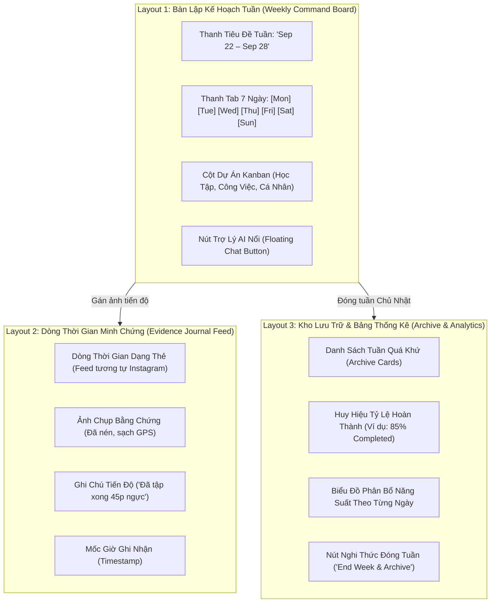

# 🎨 06. Hướng Dẫn Kiến Trúc Giao Diện (UI) & Luồng Trải Nghiệm Người Dùng (User Flow) Cho Người Không Chuyên

> [!abstract] Mục Tiêu Tài Liệu (Purpose)
> Bản hướng dẫn này được thiết kế để **bất kỳ ai — dù không có nền tảng lập trình sâu (Non-Technical, Product Manager, Designer, hay Junior Developer)** — đều có thể hiểu tường tận cách ứng dụng CalChat vận hành. Thay vì những dòng code khô khan, tài liệu diễn giải hệ thống dựa trên **3 Bố Cục Giao Diện Chính (3 Main UI Layouts)** và **Hành Trình Trải Nghiệm Xuyên Suốt Của Người Dùng (End-to-End User Flow)**, đồng thời chỉ rõ từng màn hình được điều khiển bởi các thành phần mã nguồn nào bên dưới.

---

## 🧭 1. Bức Tranh Toàn Cảnh: CalChat Là Gì Dưới Góc Nhìn Người Dùng?

Hãy tưởng tượng CalChat giống như một **"Người Trợ Lý Kỷ Luật Bản Thân Bỏ Túi"** hoạt động theo chu kỳ từng tuần:

```
    [ 💬 CHAT TỰ NHIÊN ] ──► [ 📋 BẢNG TUẦN THÔNG MINH ] ──► [ 📸 NHẬT KÝ MINH CHỨNG ] ──► [ 🏆 TỔNG KẾT & RESET ]
    Nói cho trợ lý nghe      Xem lịch 7 ngày và cột việc       Chụp ảnh chứng minh đã làm       Xem điểm % và sang tuần mới
```

- **Không cần bấm chọn từng ô ngày giờ phức tạp**: Bạn chỉ cần gõ như đang nhắn tin với bạn bè (*"học tiếng anh: luyện nghe thứ 2 thứ 4, làm bài tập thứ 6"*), trợ lý tự động sắp xếp vào đúng ngày.
- **Không chỉ tick chay rồi bỏ xó (Anti-Procrastination)**: Khi hoàn thành một việc, bạn có thể chụp một bức ảnh làm minh chứng (ảnh trang sách đã đọc, ảnh ở phòng gym, ảnh commit code).
- **Tuần nào dứt điểm tuần đó (Clean Slate Effect)**: Tối Chủ Nhật, bạn bấm "Đóng tuần" để xem mình hoàn thành được bao nhiêu %, hệ thống đóng băng tuần cũ vào kho lưu trữ và mở ra một tuần mới tinh tươm.

---

## 🖥️ 2. Bóc Tách 3 Bố Cục Giao Diện Chính (The 3 Core UI Layouts)

Ứng dụng xoay quanh **3 không gian giao diện trực quan** tương ứng với 3 nhu cầu khác nhau của người dùng:



---

### Layout 1: Bàn Lập Kế Hoạch Tuần & Trợ Lý Chat (`routes/+page.svelte`)

*Đây là màn hình "trung tâm chỉ huy" mà người dùng nhìn thấy mỗi ngày khi mở ứng dụng.*

#### Giao Diện Trực Quan Gồm Những Gì?
1. **Thanh Tiêu Đề Tuần (Top Bar)**: Hiển thị khoảng ngày hiện tại (ví dụ: `22 Tháng 9 – 28 Tháng 9`), nút mở cài đặt và nút đóng tuần.
2. **Thanh Lọc 7 Ngày Trong Tuần (This Week Strip)**: Dãy nút từ `Thứ 2` đến `Chủ Nhật`. Bấm vào `Thứ 4`, màn hình lập tức chỉ lọc ra những việc cần làm của ngày Thứ 4. Nút `Hôm Nay` tự động phát sáng.
3. **Các Cột Dự Án (Project Cards)**: Các cột chứa việc theo nhóm (ví dụ: cột *Dự Án Khởi Nghiệp*, cột *Sức Khỏe*, cột *Học Ngoại Ngữ*). Trong mỗi cột là các dòng công việc con kèm checkbox tick chọn.
4. **Hộp Thoại Trợ Lý Chat (AI Planner Modal)**: Khi bấm nút hình tia chớp/micro, một cửa sổ hiện lên cho phép bạn gõ câu tự nhiên. Máy sẽ hiển thị ngay một **Thẻ Xem Trước (Preview Draft)** để bạn xem lại trước khi bấm "Lưu".

#### Code Thực Tế Điều Khiển Màn Hình Này:
- **Khung nhìn & Header**: `AppShell.svelte`, `TopBar.svelte`
- **Bàn Kanban & Cột Dự Án**: `Board.svelte`, `ProjectCard.svelte`, `TaskRow.svelte`
- **Bộ lọc 7 ngày**: `ThisWeekPanel.svelte` (kết hợp `date.ts:dateForWeekday` để tính ngày)
- **Hộp thoại Chat**: `AIPlannerModal.svelte` (kết hợp `deterministicParser.ts` để đọc câu chữ thành task)

---

### Layout 2: Dòng Thời Gian Nhật Ký Minh Chứng (`routes/journal/+page.svelte`)

*Đây là "bức tường thành tích trực quan" giúp người dùng nhìn thấy bằng chứng thực tế những gì mình đã làm được.*

#### Giao Diện Trực Quan Gồm Những Gì?
1. **Dòng Thời Gian Dạng Thẻ Cuộn (Journal Feed)**: Trình bày theo thứ tự từ mới nhất đến cũ nhất.
2. **Ảnh Minh Chứng Trực Quan**: Mỗi thẻ hiển thị ảnh chụp sắc nét nhưng đã được hệ thống nén nhẹ nhàng để lướt mượt mà, không giật lag.
3. **Ghi Chú Kèm Theo**: Đoạn chữ ngắn ghi lại cảm xúc hoặc kết quả (ví dụ: *"Chạy bộ 5km công viên lúc sáng sớm, thời tiết mát mẻ"*).
4. **Hộp Thoại Chụp & Tải Ảnh (Evidence Modal)**: Cho phép mở trực tiếp Camera trên điện thoại hoặc chọn ảnh từ thư viện, có thanh trượt xem trước ảnh trước khi lưu.

#### Code Thực Tế Điều Khiển Màn Hình Này:
- **Giao diện dòng thời gian**: `JournalView.svelte`, `Card.svelte`
- **Hộp thoại ghi nhật ký & đính ảnh**: `UpdateModal.svelte`, `EvidenceModal.svelte`
- **Bộ máy nén & lưu ảnh ngầm**: `evidenceRepository.ts` (sử dụng Canvas 2D để bóc GPS và lưu vào IndexedDB)

---

### Layout 3: Kho Lưu Trữ Đóng Băng & Bảng Thống Kê (`routes/archive/` & `routes/stats/`)

*Đây là nơi phục vụ nghi thức "Nhìn lại bản thân" vào mỗi tối Chủ Nhật.*

#### Giao Diện Trực Quan Gồm Những Gì?
1. **Hộp Thoại Xác Nhận Đóng Tuần (End Week Modal)**: Hiện lên với lời chúc mừng, hiển thị tổng số việc đã xong và hỏi: *"Bạn có muốn đóng băng tuần này và bước sang tuần mới không?"*.
2. **Kho Lưu Trữ Các Tuần Quá Khứ (Archive Vault)**: Danh sách các tuần đã qua. Mỗi tuần được đóng gói như một tấm thẻ hồ sơ kèm huy hiệu thành tích (ví dụ: `Tuần 38: 92% Hoàn Thành 🎖️`). Bấm vào xem lại, toàn bộ công việc đều ở dạng "chỉ đọc" (Read-only) để bảo toàn tính lịch sử.
3. **Bảng Thống Kê Năng Suất (Stats Dashboard)**: Biểu đồ cột thể hiện bạn thường làm việc năng suất nhất vào thứ mấy (Thứ 2 hay Thứ 5?), tỷ lệ hoàn thành trung bình theo thời gian.

#### Code Thực Tế Điều Khiển Màn Hình Này:
- **Hộp thoại đóng tuần**: `EndWeekModal.svelte` (kết hợp `archive.ts:archiveWeek` để đóng băng dữ liệu)
- **Danh sách & chi tiết kho lưu trữ**: `ArchiveView.svelte`, `ArchiveDetail.svelte`
- **Biểu đồ thống kê**: `StatsView.svelte` (kết hợp `progress.ts:calculateProgress` để tính điểm số)

---

## 🚶 3. Hành Trình Người Dùng Toàn Diện (End-to-End User Flow)

Dưới đây là từng bước chân của một người dùng thực tế qua 4 giai đoạn trong tuần:

```
[ GIAI ĐOẠN 1: SÁNG THỨ HAI ] ──► [ GIAI ĐOẠN 2: TRONG TUẦN ] ──► [ GIAI ĐOẠN 3: BẢO MẬT NGẦM ] ──► [ GIAI ĐOẠN 4: TỐI CHỦ NHẬT ]
Lên kế hoạch bằng Chat             Thực hiện & Đính ảnh             Hệ thống nén ảnh, xóa GPS         Tổng kết điểm & Sang tuần mới
```

### Bước 1: Khởi Động Tuần Bằng Ngôn Ngữ Tự Nhiên (Sáng Thứ Hai)
1. **Thao tác**: Người dùng mở ứng dụng, thấy bảng tuần mới tinh. Người dùng bấm vào nút Trợ Lý Chat và gõ:
   > *"Khởi nghiệp: hoàn thiện trang web thứ 2 thứ 3, gọi vốn thứ 5 ;; Sức khỏe: chạy bộ 5km thứ 4 thứ 7"*
2. **Những gì người dùng thấy**:
   - Hệ thống không lưu ngay (không tạo cảm giác lo lắng bị sai sót).
   - Một **Thẻ Bản Nháp (Draft Card)** hiện lên rõ ràng:
     - 📁 Dự án: **Khởi nghiệp** $\rightarrow$ Nhiệm vụ: *Hoàn thiện trang web* (Gán vào: T2, T3) | *Gọi vốn* (Gán vào: T5).
     - 📁 Dự án: **Sức khỏe** $\rightarrow$ Nhiệm vụ: *Chạy bộ 5km* (Gán vào: T4, T7).
3. **Duyệt & Lưu**: Người dùng thấy đúng ý mình, bấm nút màu xanh **"Xác Nhận & Tạo Kế Hoạch"**. Lập tức các cột Kanban xuất hiện trên màn hình chính!

### Bước 2: Theo Dõi & Đánh Dấu Công Việc Hàng Ngày (Thứ Ba, Thứ Tư...)
1. **Thao tác**: Đến sáng Thứ Tư, người dùng mở app và bấm vào tab **`Wed` (Thứ 4)** trên thanh ngày.
2. **Những gì người dùng thấy**: Mọi việc của các ngày khác tạm ẩn đi, chỉ hiện duy nhất việc cần làm hôm nay: *Chạy bộ 5km*.
3. **Ghi Nhận Tiến Độ**:
   - Chạy bộ xong, người dùng tick vào ô vuông hoàn thành $\rightarrow$ Thanh tiến độ của dự án *Sức khỏe* nhảy lên từ 0% lên 50%.
   - Người dùng bấm vào nút icon chiếc máy ảnh trên dòng nhiệm vụ để mở `UpdateModal`.
   - Chọn ảnh chụp đôi giày chạy bộ và gõ thêm: *"Đã hoàn thành lúc 6h sáng"*.

### Bước 3: Phép Thuật Bảo Mật Chạy Ngầm (Behind-the-Scenes Magic)
*Ở bước này, người dùng không cần làm gì cả, nhưng ứng dụng âm thầm bảo vệ họ:*
- **Tẩy sạch dữ liệu định vị (GPS Stripping)**: Điện thoại thông minh thường lưu vị trí nhà ở/tọa độ vào ảnh chụp. Bộ máy `evidenceRepository.ts` tự động vẽ lại ảnh lên một tấm bảng vẽ ảo (`<canvas>`), xóa sạch 100% tọa độ và đời máy điện thoại trước khi lưu trữ.
- **Nén dung lượng siêu nhẹ**: Ảnh gốc nặng 15MB được nén thông minh xuống chỉ còn khoảng 200KB mà vẫn sắc nét, giúp điện thoại không bao giờ bị đầy bộ nhớ.

### Bước 4: Nghi Thức Tổng Kết & Tái Tạo Năng Lượng (Tối Chủ Nhật)
1. **Thao tác**: Tối Chủ Nhật, sau một tuần nỗ lực, người dùng mở ứng dụng và bấm nút **"Đóng Tuần Hiện Tại" (End Week)** trên TopBar.
2. **Những gì người dùng thấy**:
   - Hộp thoại `EndWeekModal` chúc mừng bạn đã đạt **88%** chỉ tiêu tuần.
   - Khi bấm **"Lưu Vào Kho Lưu Trữ"**, tuần hiện tại được đóng gói thành một kỷ vật lịch sử trong mục `Archive`.
   - Bảng tuần hiện tại được "quét sạch" tinh tươm, sẵn sàng đón chào Thứ Hai của tuần kế tiếp với năng lượng mới.

---

## 📊 4. Bảng Đối Chiếu: Trải Nghiệm Màn Hình vs. Tầng Kỹ Thuật

Bảng này giúp liên kết trực tiếp giữa những gì mắt người dùng nhìn thấy với các tệp mã nguồn tương ứng trong repository:

| Màn Hình Trực Quan | Hành Động Của Người Dùng | Thành Phần UI (Component) | Não Bộ Xử Lý (Logic / Store) | Nơi Cất Dữ Liệu (Storage) |
| :--- | :--- | :--- | :--- | :--- |
| **Bàn Kanban Tuần** | Xem danh sách việc, chọn tab Thứ 2 -> Chủ Nhật | `Board.svelte`<br>`ThisWeekPanel.svelte` | `date.ts:dateForWeekday`<br>`planner.store.ts` | `localStorage`<br>(Dữ liệu nhẹ < 5MB) |
| **Cửa Sổ Nhắn Tin Chat** | Nhập văn bản tự nhiên, xem bản nháp | `AIPlannerModal.svelte`<br>`Input.svelte` | `deterministicParser.ts`<br>(Bóc tách không tốn tiền AI) | Bộ nhớ RAM tạm thời<br>(Chưa lưu vào đĩa) |
| **Cột Dự Án & Việc Con** | Tick hoàn thành checkbox, bấm sửa | `ProjectCard.svelte`<br>`TaskRow.svelte` | `planner.store.ts:toggleDone`<br>`progress.ts` | `localStorage`<br>(Cập nhật cờ `done: true`) |
| **Cửa Sổ Chụp Ảnh Minh Chứng** | Chụp ảnh camera, viết nhật ký tiến độ | `EvidenceModal.svelte`<br>`UpdateModal.svelte` | `evidenceRepository.ts:compressImage`<br>(Tẩy GPS & Nén ảnh JPEG) | `IndexedDB`<br>(Kho ảnh nhị phân riêng) |
| **Bức Tường Nhật Ký (Journal)** | Cuộn lướt xem lại ảnh và chiến tích trong tuần | `JournalView.svelte`<br>`Card.svelte` | `evidenceRepository.ts:loadBlobURL`<br>(Tạo link ảnh tạm tức thì) | `IndexedDB`<br>(Lấy ảnh nén hiển thị) |
| **Hộp Thoại Tổng Kết Tuần** | Bấm đóng tuần, xem điểm % hoàn thành | `EndWeekModal.svelte`<br>`Badge.svelte` | `archive.ts:archiveWeek`<br>`date.ts:mondayOf` | `localStorage`<br>(Đóng băng vào mảng `archives`) |

---

## 💡 5. Tại Sao Thiết Kế Này Tạo Nên Trải Nghiệm Người Dùng Xuất Sắc?

1. **An Toàn Tâm Lý Tuyệt Đối (Zero-Risk Psychological Safety)**:
   - Khi dùng tính năng Chat/AI, người dùng thường sợ máy hiểu nhầm rồi lưu bậy làm xáo trộn lịch trình.
   - Bằng cơ chế **Cô Lập Bản Nháp (Draft Isolation)**: Máy chỉ được phép "đề xuất bản nháp". Quyền sinh sát tối cao luôn nằm ở ngón tay người dùng khi bấm nút "Xác Nhận".
2. **Động Lực Thị Giác Từ Bằng Chứng Thật (Visual Proof of Work)**:
   - Các ứng dụng To-Do thông thường chỉ có những chiếc checkbox vô hồn, rất dễ gây cảm giác chán nản hoặc tích gian dối.
   - Tính năng **Nhật Ký Ảnh (Photo Evidence)** tạo cảm giác thỏa mãn thị giác (tương tự lướt nhật ký kỷ niệm), thúc đẩy tính kỷ luật tự giác.
3. **Hiệu Ứng Bắt Đầu Lại Từ Đầu (The Clean Slate Effect)**:
   - Khi một tuần có quá nhiều việc dở dang, người dùng thường cảm thấy tội lỗi và muốn bỏ luôn ứng dụng.
   - Cơ chế **Đóng Tuần Chủ Nhật** cho phép người dùng đóng băng tuần cũ và bắt đầu tuần mới với một "tờ giấy trắng", xóa bỏ hoàn toàn áp lực tâm lý tiêu cực.
