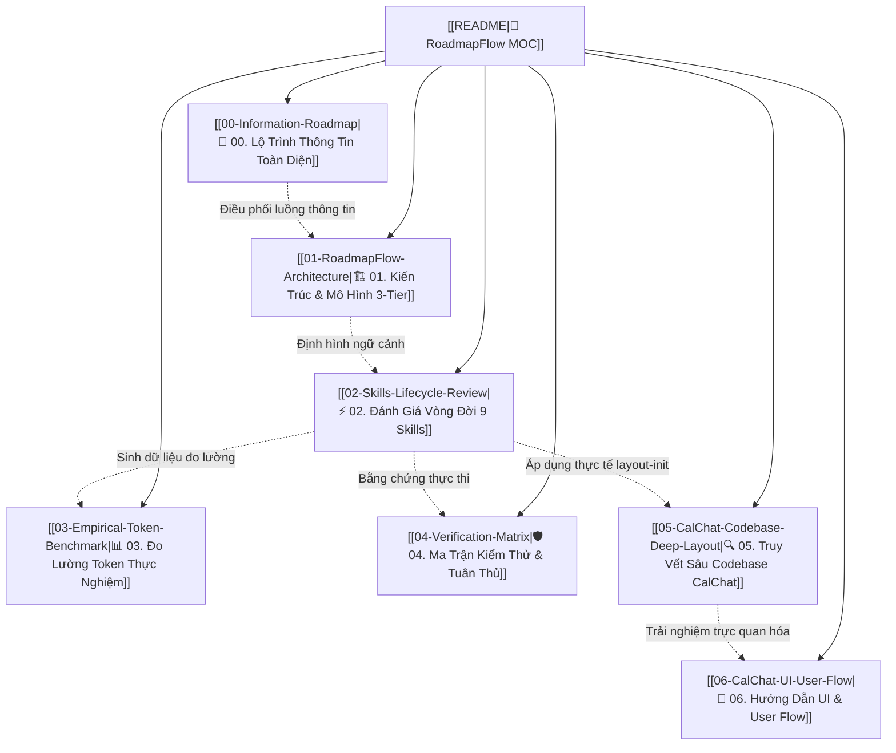

# 🧭 RoadmapFlow — Executive Review & Knowledge Graph

> [!abstract] Executive Summary
> **RoadmapFlow** là bộ engine xác định (deterministic engine) và hệ thống kỹ năng AI (IBM Bob 2.0 / Claude Code / Gemini) giải quyết triệt để vấn đề **ô nhiễm ngữ cảnh (context window bloat)** và **chi phí token bùng nổ** trong các dự án phát triển phần mềm nhiều phiên (multi-session). Bằng việc áp dụng **Mô hình Ngữ cảnh 3-Tier (3-Tier Context Model)**, hệ thống giảm **91.13%** token mỗi phiên làm việc và bảo toàn **110,150 tokens** sau 10 phiên phát triển liên tục.

---

## 🗺️ Bản Đồ Nội Dung (Obsidian Map of Content - MOC)

- **[[00-Information-Roadmap|00. Cấu Trúc Lộ Trình Thông Tin Toàn Diện (Information Roadmap)]]**: Định nghĩa 5 tầng thông tin (5-Layer Stack), luồng chuyển đổi trạng thái từ tài liệu thô đến artifacts nghiệm thu, và lộ trình hoàn thiện hồ sơ nộp thi.
- **[[01-RoadmapFlow-Architecture|01. Kiến Trúc 3-Tier & Chiến Lược Xử Lý Tài Liệu]]**: Phân tích chi tiết Tier 1, Tier 2, Tier 3; cơ chế Ingest -> Synthesize -> Isolate cho tài liệu cũ/nghiên cứu; và bản đồ luồng phụ thuộc.
- **[[02-Skills-Lifecycle-Review|02. Báo Cáo Chi Tiết Vòng Đời 9 Skills]]**: Đánh giá toàn diện 9 bước từ `layout-init`, `scaffold`, `planner`, `navigator`, `dev-workflow`, `sync`, `validate`, `audit` đến `benchmark`.
- **[[03-Empirical-Token-Benchmark|03. Báo Cáo Đo Lường Thực Nghiệm & Tiết Kiệm Token]]**: Dữ liệu thực nghiệm chứng minh cắt giảm 91.13% token/session và vượt mốc 100,000 tokens tiết kiệm qua 10 sessions.
- **[[04-Verification-Matrix|04. Ma Trận Xác Minh, Kiểm Thử & Tuân Thủ]]**: Bằng chứng Unit Test 7/7 PASSED, Plugin Test PASSED, Scaffold Audit 100% COMPLIANT.
- **[[05-CalChat-Codebase-Deep-Layout|05. Phân Tích & Truy Vết Sâu Codebase CalChat (/Downloads/app/)]]**: Áp dụng thực chiến kỹ năng `layout-init` bóc tách codebase CalChat, phân định code sống vs scaffold, và kiểm chứng 100% đường dẫn.
- **[[06-CalChat-UI-User-Flow|06. Hướng Dẫn Kiến Trúc Giao Diện (UI) & Luồng Trải Nghiệm (User Flow)]]**: Giải thích trực quan 3 Layout chính và hành trình người dùng cho người không chuyên kỹ thuật, ánh xạ trực tiếp tới các component.

---

## ⚡ Bảng Tổng Hợp Vòng Lặp Kỹ Năng (The 9-Skills Loop)

| Bước | Kỹ Năng (Skill) | Vai Trò & Trách Nhiệm Chính | File Trọng Tâm | Kết Quả Thực Nghiệm |
| :---: | :--- | :--- | :--- | :---: |
| **01** | `layout-init` | Lập bản đồ codebase, components, logic & flow | [[LAYOUT.md]] | `7/7 Tests PASS` |
| **02** | `roadmap-scaffold` | Dựng khung vỏ 3-Tier, layout component reuse | `.bob/context/`, `src/db/` | `Tier 1: 625 tok` |
| **03** | `roadmap-planner` | Tổng hợp tài liệu `planning/` thành Master Plan | [[PLAN.md]], [[ROADMAP.md]] | `Validated 100%` |
| **04** | `roadmap-navigator` | Trích xuất Snapshot Tier 2 cho active phase | `.bob/context/current-phase.md` | `192 tok (≤ 200)` |
| **05** | `dev-workflow` | Thực thi mã nguồn, chạy test suite, kiểm tra exit criteria | `src/`, `tests/` | `Suite PASS (0.02s)` |
| **06** | `roadmap-sync` | Quét git diff, đồng bộ trạng thái `[x]`, tính lại progress | [[ROADMAP.md]] | `Auto-sync OK` |
| **07** | `roadmap-validate` | Kiểm tra tính hợp lệ của binary exit criteria & phase size | `src/roadmap.py validate` | `100% Compliant` |
| **08** | `roadmap-audit` | Audit toàn bộ tiêu chuẩn repository theo chuẩn RoadmapFlow | `src/scaffold.py audit` | `100% COMPLIANT` |
| **09** | `roadmap-benchmark` | Mô phỏng 10 session đo lường token thực tế | `docs/BENCHMARK_REPORT.md` | `Tiết kiệm 91.13%` |

---

## 📈 Chỉ Số Hiệu Năng Cốt Lõi (Key Metrics at a Glance)

> [!success] Kết Quả Đo Lường Đạt Chuẩn
> - **Ngữ cảnh mặc định (Baseline Context)**: `9,124 tokens` / phiên làm việc
> - **Ngữ cảnh tối ưu qua RoadmapFlow (Tier 1+2)**: `817 tokens` / phiên làm việc
> - **Ngân sách Snapshot Giai đoạn (Tier 2 Snapshot)**: `192 tokens` (Ngân sách: $\le 200$ tokens)
> - **Tỷ lệ cắt giảm token phiên đơn lẻ**: **`91.13%`** (Mục tiêu thiết kế: $>90\%$)
> - **Tổng token bảo toàn sau 10 phiên làm việc**: **`110,150 tokens`** (Tiết kiệm **`93.2%`**)

---

## 🔗 Liên Kết Nhanh Trong Hệ Thống
- Master Executive Report: [`MASTER_EXECUTIVE_AUDIT_AND_BENCHMARK.md`](file:///home/pro/hackathon/MASTER_EXECUTIVE_AUDIT_AND_BENCHMARK.md)
- Master Plan: [[PLAN.md]]
- Live Status Board: [[ROADMAP.md]]
- Architecture Layout: [[LAYOUT.md]]
- Lộ trình thông tin: [[00-Information-Roadmap]]
- Báo Cáo Benchmark Gốc: `docs/BENCHMARK_REPORT.md`
- Dữ Liệu Benchmark JSON: `things/benchmark_results.json`
